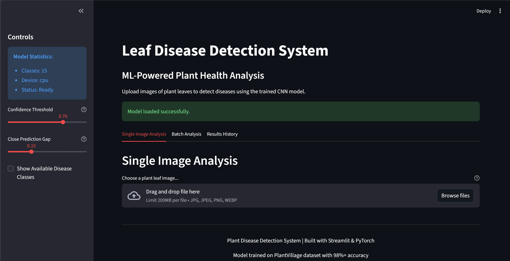
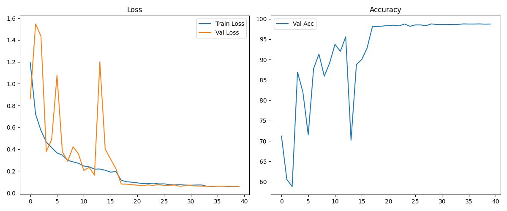

# 🌱 Plant Disease Detection using CNN

[](https://python.org)
[](https://pytorch.org/)
[](https://streamlit.io/)
[](LICENSE)

An AI-powered plant disease detection system using Convolutional Neural Networks (CNN) to classify plant diseases from leaf images with **98%+ accuracy**.

## 🎯 Features

### 🔬 **Machine Learning Capabilities**
- **Custom CNN Architecture** with 1.68M parameters
- **15 Disease Classes** across 3 major crops (Pepper, Potato, Tomato)
- **98%+ Validation Accuracy** on PlantVillage dataset
- **Confidence Scoring** with adjustable thresholds
- **Top-3 Predictions** for uncertainty handling

### 🖥️ **Web Application**
- **Interactive Streamlit Interface** with professional UI
- **Single Image Analysis** with real-time predictions
- **Batch Processing** for multiple images
- **Results History** with filtering and analytics
- **Disease Information Cards** with treatment recommendations
- **CSV Export** for analysis results

### 🛠️ **Technical Features**
- **Robust Data Pipeline** with error handling
- **Data Augmentation** for improved generalization
- **Model Checkpointing** with automatic best model saving
- **Learning Curve Visualization** for training analysis

## 🏗️ Tech Stack

### **Deep Learning Framework**
- **PyTorch** - Neural network implementation and training
- **torchvision** - Image transformations and data loading

### **Web Framework & Visualization**
- **Streamlit** - Interactive web application
- **Plotly** - Advanced charts and visualizations
- **Matplotlib** - Training progress plots

### **Data Science & ML**
- **scikit-learn** - Data splitting and label encoding
- **NumPy** - Numerical computations
- **Pandas** - Data manipulation and analysis

### **Image Processing**
- **PIL (Pillow)** - Image loading and manipulation
- **OpenCV** - Advanced image preprocessing

## 📊 Dataset

The model is trained on the **PlantVillage Dataset** containing 54,000+ images of plant leaves.

**Dataset Source:** [PlantVillage Dataset on Kaggle](https://www.kaggle.com/datasets/arjuntejaswi/plant-village)

### **Supported Disease Classes:**
- **Pepper Bell:** Bacterial spot, Healthy
- **Potato:** Early blight, Late blight, Healthy
- **Tomato:** Bacterial spot, Early blight, Late blight, Leaf mold, Septoria leaf spot, Spider mites, Target spot, Yellow Leaf Curl Virus, Mosaic virus, Healthy

### **Data Split:**
- **Training:** 70% (~37,800 images)
- **Validation:** 15% (~8,100 images)  
- **Test:** 15% (~8,100 images)

## 🚀 Installation & Setup

### **1. Clone Repository**
```bash
git clone https://github.com/yourusername/Plant-Disease-Detection-using-CNN.git
cd Plant-Disease-Detection-using-CNN
```

### **2. Create Virtual Environment**
```bash
python -m venv venv
# Windows
venv\Scripts\activate
# Linux/Mac
source venv/bin/activate
```

### **3. Install Dependencies**
```bash
pip install -r requirements.txt
```

### **4. Download Dataset**
- Download the PlantVillage dataset from Kaggle (link above)
- Extract to `PlantVillage/` folder in project root
- Ensure folder structure: `PlantVillage/class_name/image.jpg`

## 💻 Usage

### **Training the Model**
```bash
python train.py
```
This will:
- Load and preprocess the PlantVillage dataset
- Train the CNN model with data augmentation
- Save the best model as `best_model.pth`
- Generate learning curves and artifacts

### **Single Image Prediction**
```bash
python inference.py path/to/your/image.jpg
```

### **Web Application**
```bash
streamlit run streamlit_app.py
```
Access the app at `http://localhost:8501`

## 📁 Project Structure

```
Plant-Disease-Detection-using-CNN/
├── 📄 plant_disease_model.py     # CNN architecture & data pipeline
├── 🏋️ train.py                  # Training script
├── 🔍 inference.py               # Command-line prediction
├── 🌐 streamlit_app.py           # Web application
├── 📊 requirements.txt           # Dependencies
├── 🚫 .gitignore                # Git ignore rules
├── 📖 README.md                 # This file
│
├── 📁 PlantVillage/              # Dataset (not in repo)
│   ├── 🌶️ Pepper__bell___Bacterial_spot/
│   ├── 🌶️ Pepper__bell___healthy/
│   ├── 🥔 Potato___Early_blight/
│   └── ... (other disease classes)
│
├── 🤖 Generated Files (after training):
│   ├── best_model.pth            # Trained model weights (6.7MB)
│   ├── class_names.json          # Disease class names
│   ├── label_encoder.pkl         # Label encoder
│   ├── inference_transform.pkl   # Image preprocessing
│   └── learning_curves.png       # Training visualization
│
└── 🔧 Development:
    ├── venv/                     # Virtual environment
    └── __pycache__/              # Python cache
```

## 🎯 Model Performance

### **Architecture Details**
- **Input Size:** 224×224×3 RGB images
- **Convolutional Layers:** 3 blocks (32, 64, 128 filters)
- **Techniques:** BatchNorm, Dropout, MaxPooling, ReLU
- **Classification:** Fully connected layers (512 → 15 classes)
- **Parameters:** 1,688,079 trainable parameters

### **Training Results**
- **Validation Accuracy:** 98%+
- **Training Strategy:** Early stopping, Learning rate scheduling
- **Data Augmentation:** Rotation, flips, color jitter
- **Convergence:** 50+ epochs with optimal checkpointing

## 🖼️ Screenshots

### Web Application Interface


### Training Progress


## 🤝 Contributing

1. Fork the repository
2. Create feature branch (`git checkout -b feature/AmazingFeature`)
3. Commit changes (`git commit -m 'Add AmazingFeature'`)
4. Push to branch (`git push origin feature/AmazingFeature`)
5. Open a Pull Request

## 📝 License

This project is licensed under the MIT License - see the [LICENSE](LICENSE) file for details.

## 🙏 Acknowledgments

- **PlantVillage Dataset** - Dataset providers
- **PyTorch Team** - Deep learning framework
- **Streamlit** - Web application framework
- **Agricultural Research Community** - Domain expertise

---
**⭐ Star this repository if you found it helpful!**